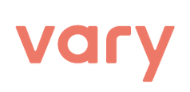

# [Internship] 2022 하반기 - 기업 인턴십 스프린트 회고

 

 
 
 

## 기업

---

- VARY(배리)
   

## 서비스

---

- 영업, 마케팅을 위한 **_모바일 빌더_** 솔루션을 제공하는 SaaS

 

## 기술스택

---

### `Environment`

### `Development`

### `Communication`

 

## 기간

---

- 2022.12.12 ~ 2023.01.05(4주)

 

## 프로젝트 내용

---

- Admin 페이지 구현 - 전체 사용자정보 조회 및 사용자 상세정보 조회
- Vary 관리자가 서비스를 이용 중인 회원들의 가입/로그인/제작/발송/결제 등의 정보를 확인하기 위한 페이지

 

## 스프린트

---

- [1_Sprint](1_sprint.md)
- [2_Sprint](2_sprint.md)
- [3_Sprint](3_sprint.md)
